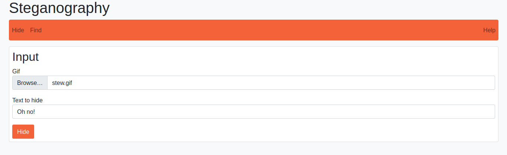
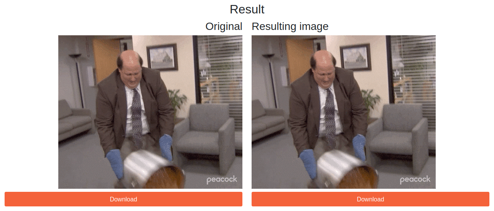
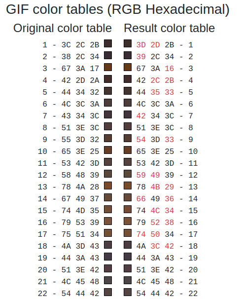
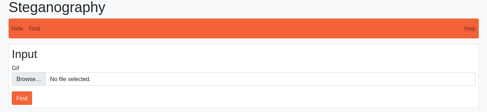
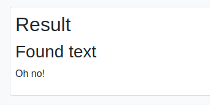

# Steganography app

## How to use

### Hiding a message
0. Find a GIF (e.g. here: https://giphy.com/) in which you would like to store the message/data
1. Navigate to the `Hide` tab inside the application
2. In the `Gif` field, select your GIF from the step 0
3. In the `Text to hide` field, insert your secret message

4. Submit the form by pressing the `Hide` button

5. You will see an original GIF on the left and a GIF which contains a secret message on the right
6. Download the GIF with the message by pressing the `Download` button beneath it
7. (Optional) Under the download buttons are color tables in which you may analyse which bytes have changed in the resulting GIF

### Finding a message
0. Acquire a GIF which contains a hidden message
1. Navigate to the `Find` tab inside the application
2. In the `Gif` field, select your GIF from the step 0

3. Submit the form by pressing the `Find` button
4. You will see the secret message!

## About
Hides (or finds) data inside a color table of a GIF. 
Bits of data/message are hidden in the least significant bit of every color byte.
Can hide 96B of data in GIFs with 256 colors.
For GIFs with smaller number of colors, the amount of storable data is equal to `colors * 3 / 8`

## Author
Made by Ivan Crnjak for the course Cryptology at Mendel University in Brno

## Useful links
* https://en.wikipedia.org/wiki/GIF
* https://hexed.it/
* https://www.matthewflickinger.com/lab/whatsinagif/bits_and_bytes.asp